# EZ-PZ Tactical LZ/PZ Planner — User Guide

EZ-PZ is a map-based planning tool for helicopter landing zone / pickup zone (LZ/PZ) operations: analyze terrain, lay out aircraft and control measures, produce LZ/PZ card packages, and sketch or edit AMPS mission routes (`.msnx` files).

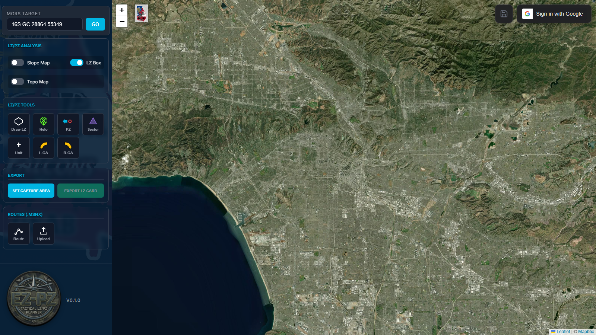

The interface has two parts:

- **Left panel** — MGRS search, LZ/PZ analysis data, placement tools, export, and route tools.
- **Map** — the working area. Floating over it: the unit badge and zoom controls (top-left), the **Routes** panel (appears when routes exist), and the **save/load + account** cluster (top-right).

---

## 1. Getting started: set a target

Type an MGRS grid in the **MGRS Target** box and press **GO**. The map flies to the location, drops a gold star on the target, and automatically generates two **doghouses** (SP/RP flight-data cards) beside it.

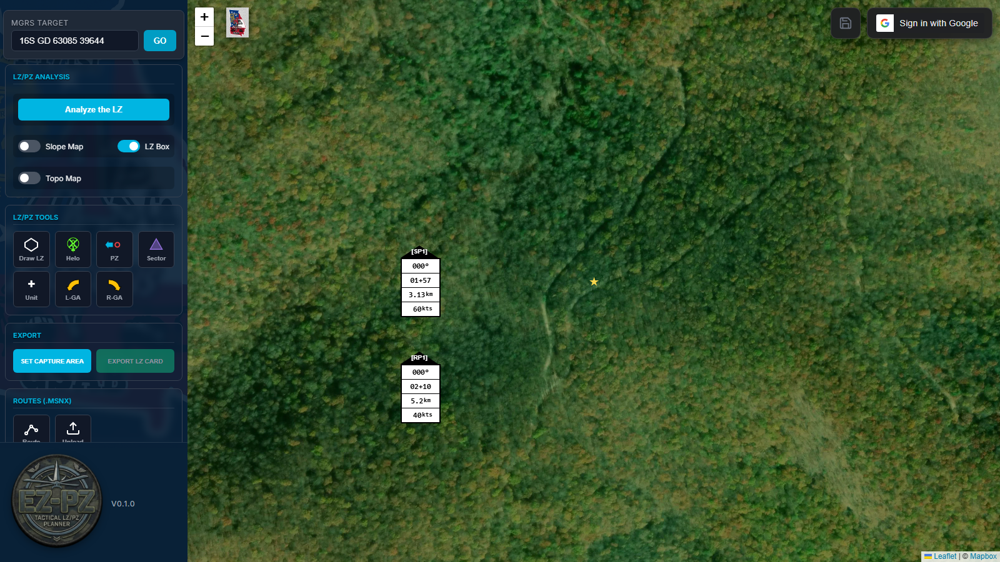

You can also **right-click anywhere on the map** → **Set as Target** to move the target without typing a grid.

- Doghouse values (heading, time, distance, airspeed) are editable — click a value and enter a new one.
- Toggle **Topo Map** for a topographic basemap instead of satellite.

## 2. Analyze the LZ

With a target set, press **Analyze the LZ**. The app runs terrain and imagery analysis around the target (this takes a moment) and fills the analysis card:

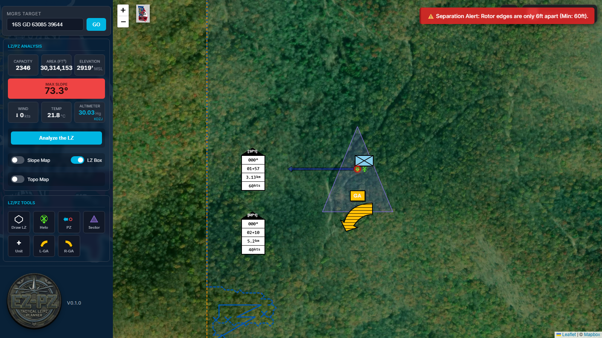

- **Capacity / Area / Elevation** — derived from the detected usable area.
- **Max Slope** — red when it exceeds safe limits.
- **Wind / Temp / Altimeter** — live weather from the nearest station (KDZJ here).
- The detected LZ boundary is drawn as a dashed blue outline (toggle with **LZ Box**).

Enable **Slope Map** to overlay a color-coded slope heatmap (green = flat, red = steep). Hover a cell for the exact slope in degrees:

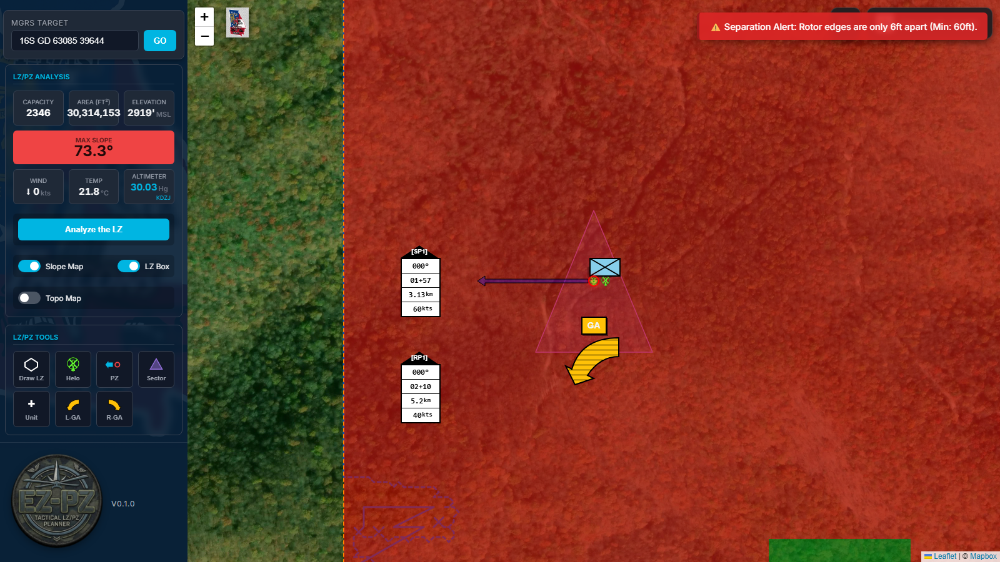

**Custom LZ**: if the auto-detected boundary isn't what you want, use **Draw LZ** in the tools grid — click the map to outline your own polygon, then click **Finish LZ**. Right-click the polygon for options (set target, analyze, delete).

## 3. Placement tools

The **LZ/PZ Tools** grid places draggable markers on the map:

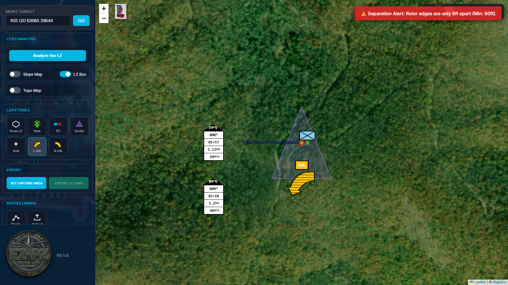

| Tool | What it does |
|---|---|
| **Helo** | Places a helicopter with rotor-diameter footprint. Aircraft too close to each other trigger a red **Separation Alert** banner (visible above). |
| **PZ** | Pickup-zone marker with a draggable direction tip. |
| **Sector** | Sector-of-fire triangle — drag its corner points to shape it. |
| **Unit** | Opens a menu of unit symbols to place. |
| **L-GA / R-GA** | Left/right go-around arrows. |

Everything is draggable; most markers can be deleted from their own controls or right-click.

## 4. Export an LZ/PZ card

1. Press **Set Capture Area** — a red box appears on the map; drag/resize it to frame the imagery for the card.

   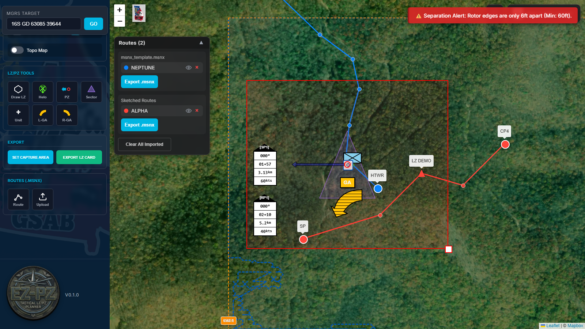

2. Press **Export LZ Card**. The export form opens — LZ name (with name suggestions), grid data, frequencies, formations, weapons status, remarks, and any nearby **NOTAMs** you check are included:

   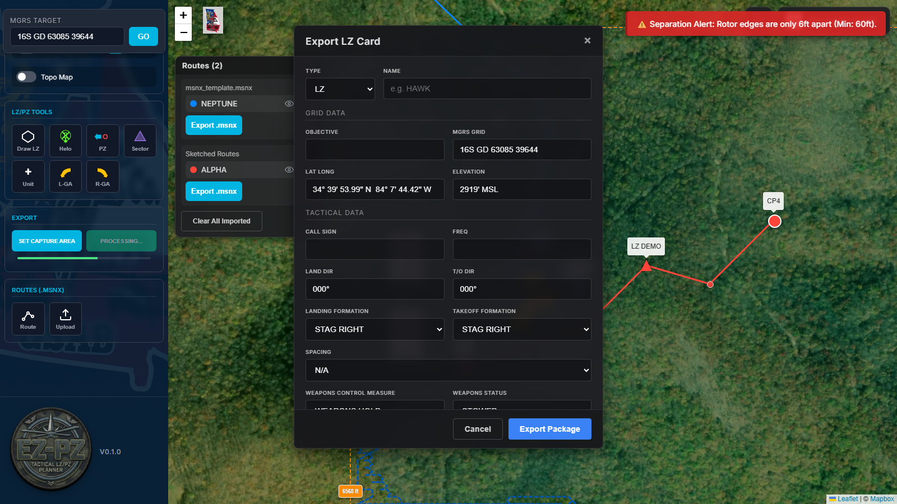

3. **Export Package** downloads the filled LZ/PZ card as an Excel package with the captured map imagery.

## 5. Routes (.msnx)

The **Routes (.msnx)** card has two tools:

- **Route** — sketch a new route by clicking on the map.
- **Upload** — import an existing AMPS/Mission X `.msnx` file.

### Sketching a route

Click **Route**, then click along your intended flight path — a dashed preview line follows your clicks:

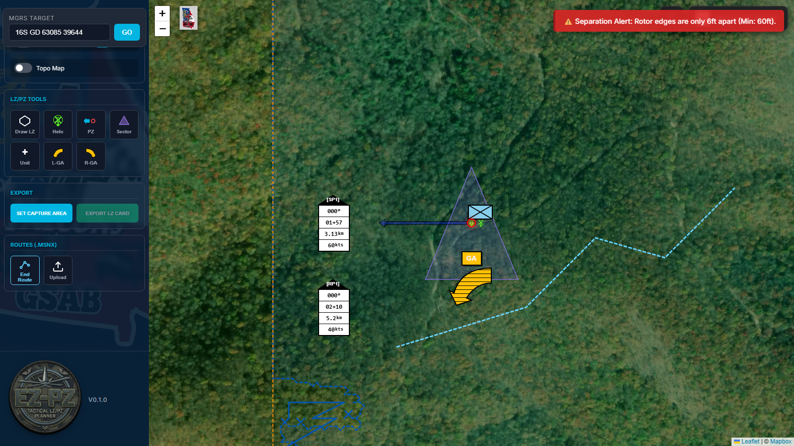

Click **End Route** and name it. The route renders in its own color with the first/last points as designated route points (SP and a checkpoint) and everything between as small **shaping points**:

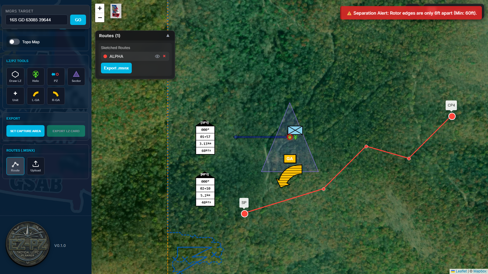

### Designating AMPS points

This mirrors how AMPS models routes: only *designated* points (SP, checkpoints, RPs, LZ/PZs) appear as route structure in AMPS — shaping points exist only as serpentine geometry so distance/time calculations follow your actual drawn path.

**Right-click any route point** to designate it:

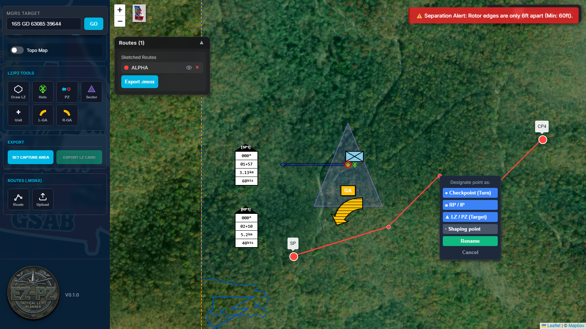

- **● Checkpoint (Turn)** — circle symbol
- **■ RP / IP** — square symbol
- **▲ LZ / PZ (Target)** — triangle symbol
- **· Shaping point** — demote back to serpentine geometry
- **Rename** — change the point's label

Symbols match AMPS iconography, and designations survive export/re-import. Each route keeps at least two designated endpoints.

**Editing**: drag any point to move it. Right-click the route *line* → **Insert Point Here** to add a point mid-leg.

### Importing a .msnx

Click **Upload** and select a `.msnx` file. Every route in the mission renders in its own color — designated points with their proper symbols and labels, serpentine points as small dots:

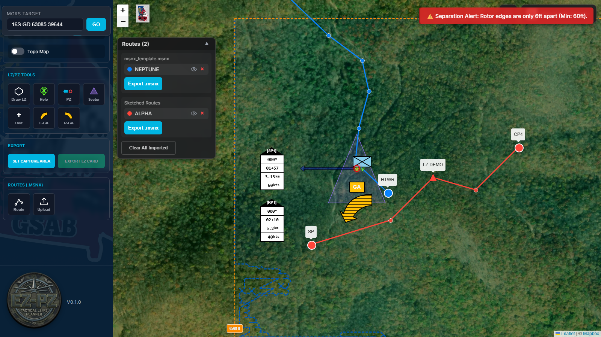

Imported routes are fully editable: drag points (serpentine geometry updates too) and insert points on legs.

### The Routes panel

All routes appear in the floating **Routes** panel (draggable by its header, collapsible with ▲):

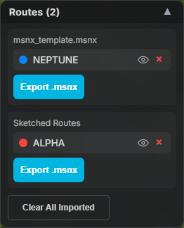

- **Eye** — hide/show a route without deleting it.
- **×** — remove a route.
- **Export .msnx** — per group: imported files re-export with your edits; sketched routes export as a brand-new mission file.

### Opening exports in AMPS

Exported files deliberately contain geometry only — after opening one in AMPS, **recalculate the route** to regenerate performance data (fuel, timing, elevations, speeds).

## 6. Account & saved maps

The top-right cluster holds the save/load button and Google sign-in:

- **Sign in with Google** to enable saving. Once signed in, the cluster shows your profile picture, name, and a log-out button.
- The **save/load button** (disk icon) opens the Saved Maps window: name and save the current map state, or load/update/delete previous saves. Saving captures the full picture — target, analysis, all placed tools, and doghouse edits. The button is grayed out until you sign in.

## 7. The unit badge

The A Co. 1-171st GSAB Falcons patch sits next to the zoom controls. Give it a click.

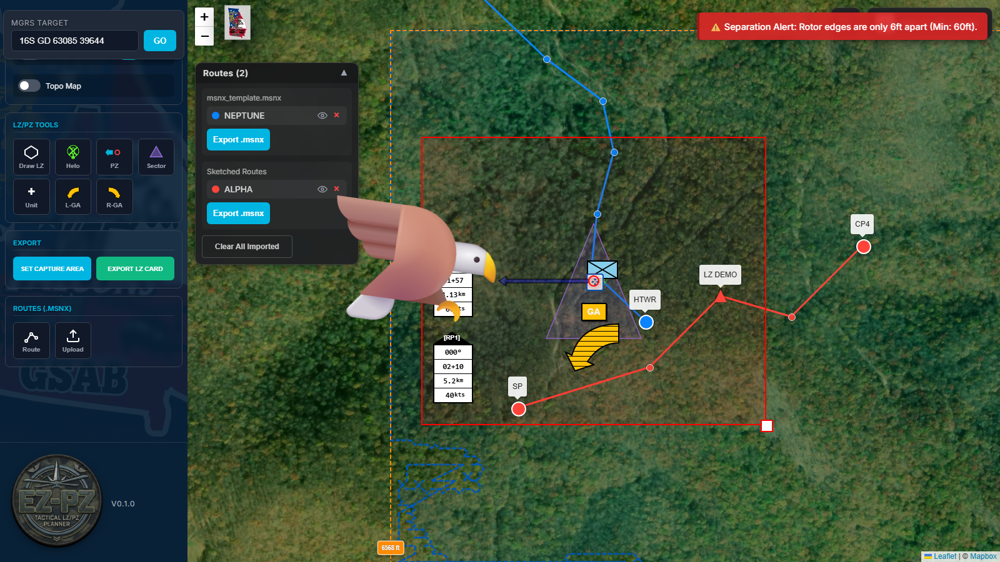

---

## Tips & troubleshooting

- **First action after idle is slow** — the backend spins down when unused; the first analysis/search after a while can take up to a minute while it wakes. Subsequent requests are fast.
- **Sign-in button does nothing / login popup blocked** — make sure your browser allows popups for the site, and give a slow backend a moment to respond after choosing an account.
- **Imported route looks like a straight line between two named points** — that's correct: the serpentine shaping points still exist (small dots). If a route is cluttering the view, hide it with the eye toggle instead of deleting.
- **On mobile**, the left panel is behind the ☰ button, and quick-access tool buttons appear along the map edge.
