# EZ-PZ Tactical LZ/PZ Planner — User Guide

EZ-PZ is a map-based planning tool for helicopter landing zone / pickup zone (LZ/PZ) operations: analyze terrain, lay out aircraft and control measures, produce LZ/PZ card packages, and sketch or edit AMPS mission routes (`.msnx` files).

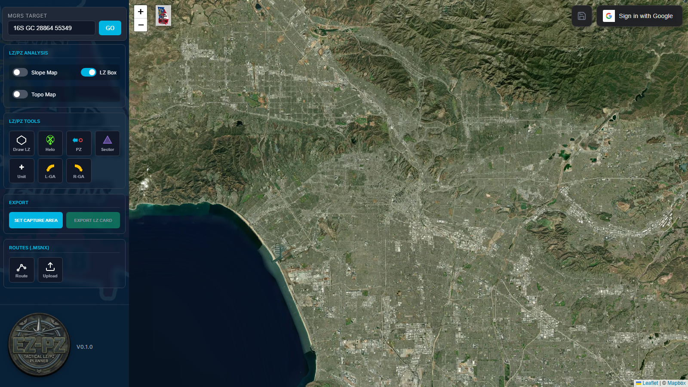

The interface has four parts:

- **Left panel** — MGRS search, LZ/PZ analysis data, placement tools, export, and route tools.
- **Top bar** — where your work is saved (**Library**, your own; Mission Packs come later), **Import**, the **Library** button, and your account (sign out is in its menu).
- **Map** — the working area, with the unit badge and zoom controls at its top-left.
- **Dock** (right) — one panel at a time, picked from the icons on its right edge: **LZ/PZ**, **Routes**, **Threats** and **Imports**. Click the open panel's icon again to fold it away. A small amber dot on an icon means something there has unsaved changes. On a narrow window the dock is a sheet along the bottom: drag its handle up or down, or tap a tab.

---

## 1. Getting started: set a target

Type an MGRS grid in the **MGRS Target** box and press **GO**. The map flies to the location, drops a gold star on the target, and automatically generates two **doghouses** (SP/RP flight-data cards) beside it.

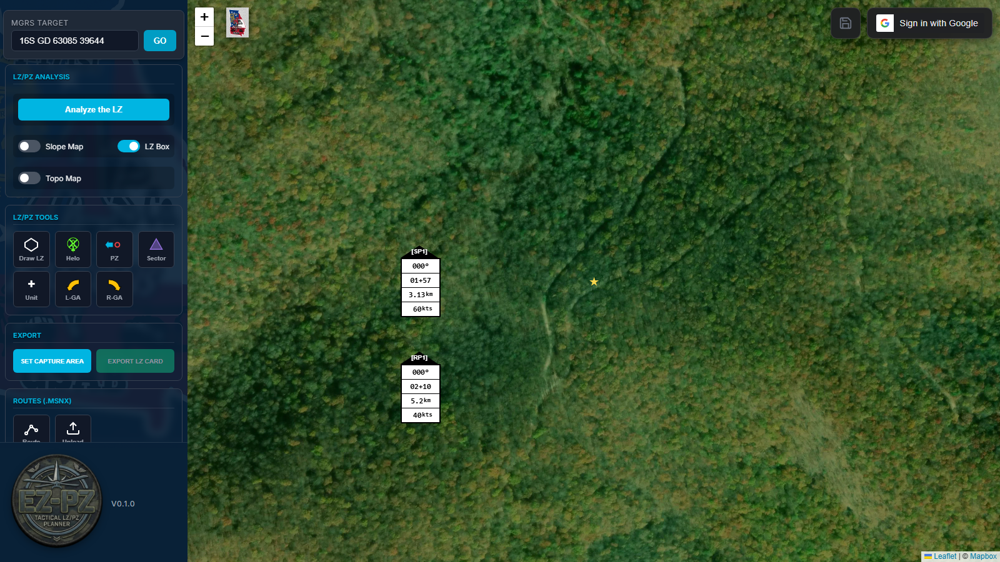

You can also **right-click anywhere on the map** → **Set as Target** to move the target without typing a grid.

- Doghouse values (heading, time, distance, airspeed) are editable — click a value and enter a new one.
- Use **Layers** (bottom left of the map) to switch between **Satellite**, **Topo** and the **VFR** sectional, and to turn on the **MGRS grid** over any of them. The grid draws zone boundaries, 100 km squares, and lines at 10 km, 1 km or 100 m as you zoom in, labelled with the zone, the square and each line's digits, so a grid reference can be read straight off the map. It is for planning on screen only: it never appears on an exported LZ card.

## 2. Analyze the LZ

With a target set, press **Analyze the LZ**. The app runs terrain and imagery analysis around the target (this takes a moment) and fills the analysis card:

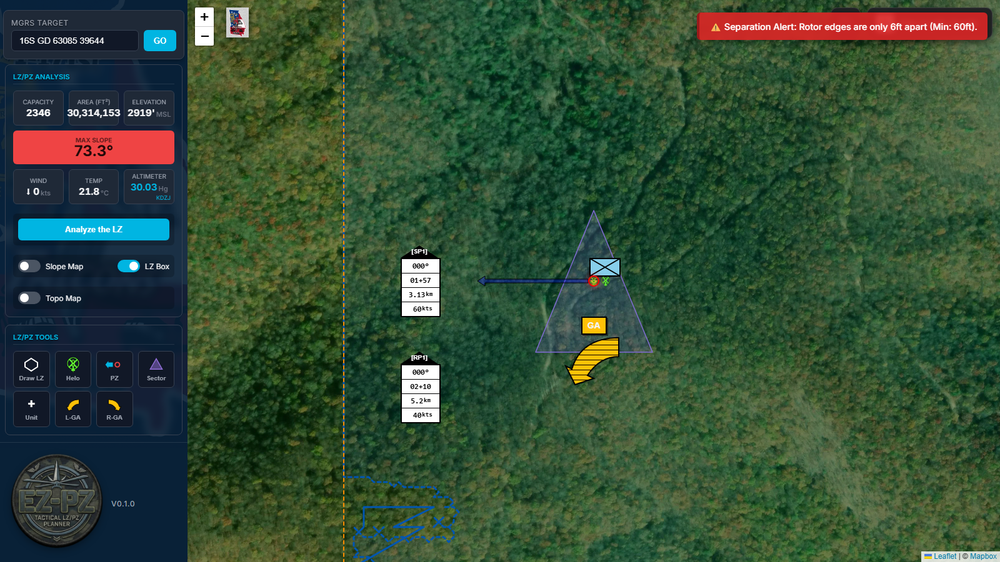

- **Capacity / Area / Elevation** — derived from the detected usable area.
- **Max Slope** — red when it exceeds safe limits.
- **Wind / Temp / Altimeter** — live weather from the nearest station (KDZJ here).
- The detected LZ boundary is drawn as a dashed blue outline (toggle with **LZ Box**).

Enable **Slope Map** to overlay a color-coded slope heatmap (green = flat, red = steep). Hover a cell for the exact slope in degrees:

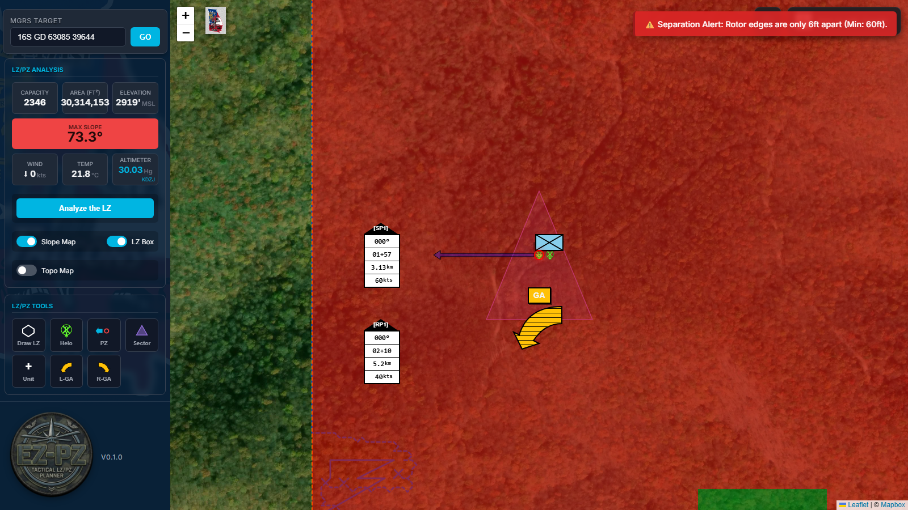

**Custom LZ**: if the auto-detected boundary isn't what you want, use **Draw LZ** in the tools grid — click the map to outline your own polygon, then click **Finish LZ**. Right-click the polygon for options (set target, analyze, delete).

## 3. Placement tools

The **LZ/PZ Tools** grid places draggable markers on the map:

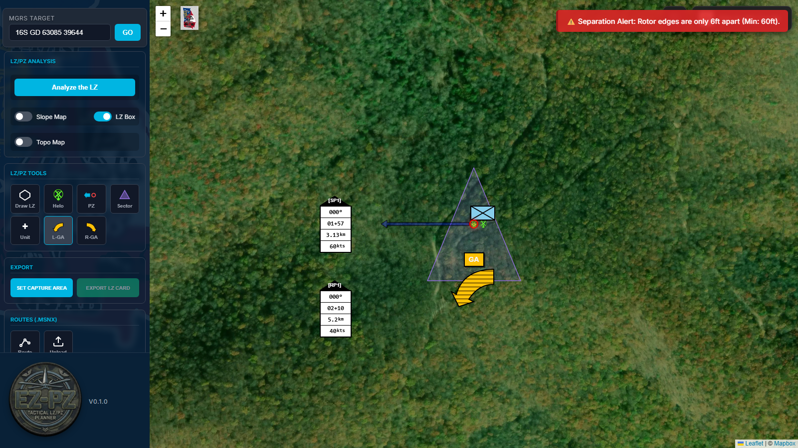

| Tool | What it does |
|---|---|
| **Helo** | Places a helicopter with rotor-diameter footprint. Aircraft too close to each other trigger a red **Separation Alert** banner (visible above). |
| **PZ** | Pickup-zone marker with a draggable direction tip. |
| **Sector** | Sector-of-fire triangle — drag its corner points to shape it. |
| **Unit** | Opens a menu of unit symbols to place. |
| **L-GA / R-GA** | Left/right go-around arrows. |

Everything is draggable; most markers can be deleted from their own controls or right-click.

## 4. Export an LZ/PZ card

1. Press **Set Capture Area** — a red box appears on the map; drag/resize it to frame the imagery for the card.

   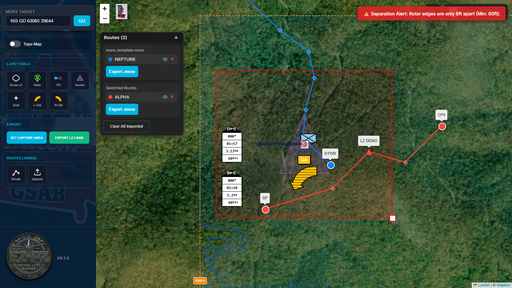

2. Press **Export LZ Card**. The export form opens — LZ name (with name suggestions), grid data, frequencies, formations, weapons status, remarks, and any nearby **NOTAMs** you check are included:

   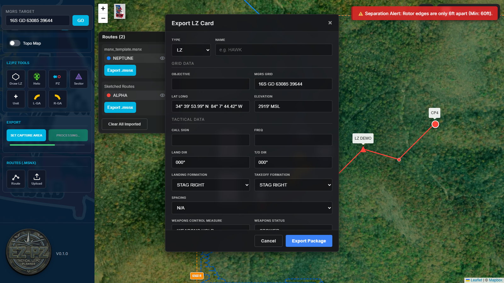

3. **Export Package** downloads the filled LZ/PZ card as an Excel package with the captured map imagery.

## 5. Routes (.msnx)

The **Routes (.msnx)** card has two tools:

- **Route** — sketch a new route by clicking on the map.
- **Upload** — import an existing AMPS/Mission X `.msnx` file.

### Sketching a route

Click **Route**, then click along your intended flight path — a dashed preview line follows your clicks:

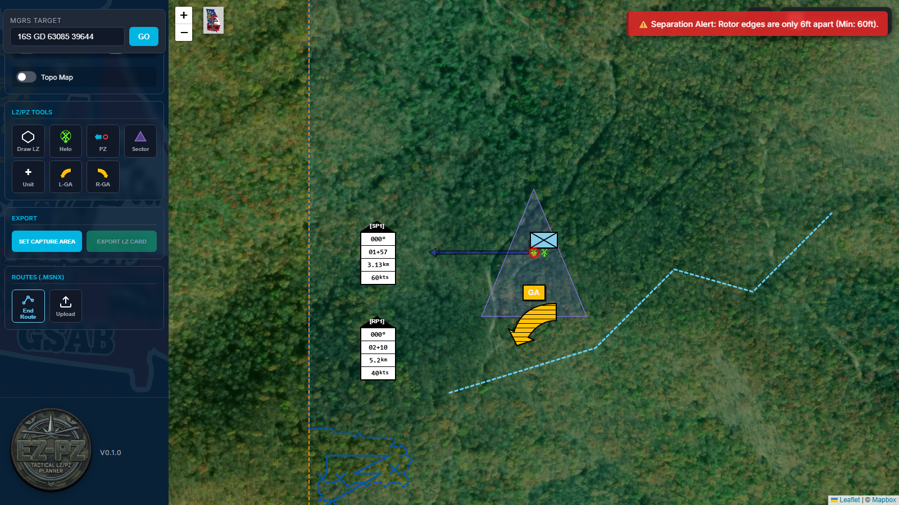

Click **End Route** and name it. The route renders in its own color with the first/last points as designated route points (SP and a checkpoint) and everything between as small **shaping points**:

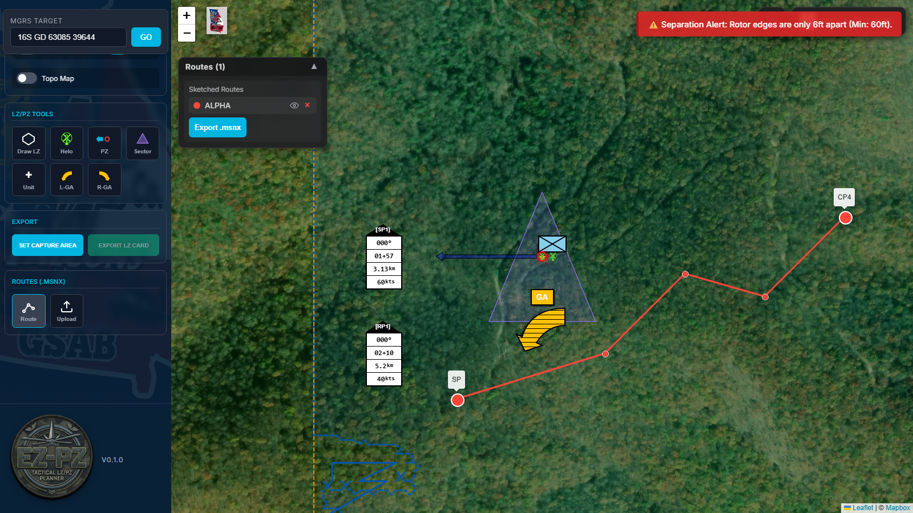

### Designating AMPS points

This mirrors how AMPS models routes: only *designated* points (SP, checkpoints, RPs, LZ/PZs) appear as route structure in AMPS — shaping points exist only as serpentine geometry so distance/time calculations follow your actual drawn path.

**Right-click any route point** to designate it:

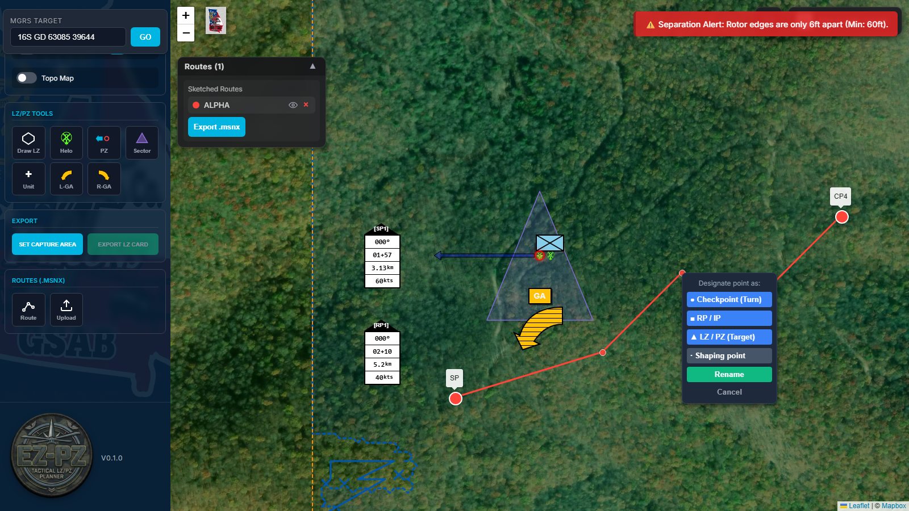

- **● Checkpoint (Turn)** — circle symbol
- **■ RP / IP** — square symbol
- **▲ LZ / PZ (Target)** — triangle symbol
- **· Shaping point** — demote back to serpentine geometry
- **Rename** — change the point's label

Symbols match AMPS iconography, and designations survive export/re-import. Each route keeps at least two designated endpoints.

**Editing**: drag any point to move it. Right-click the route *line* → **Insert Point Here** to add a point mid-leg.

### Importing a .msnx

Use **Import → Mission file** in the top bar, **Import .msnx** at the foot of the Routes panel, or drop the file anywhere on the map (see *Importing files* below). Every route in the mission renders in its own color — designated points with their proper symbols and labels, serpentine points as small dots:

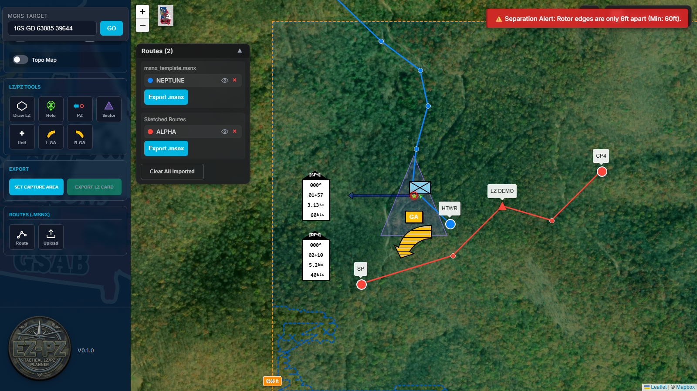

Imported routes are fully editable: drag points (serpentine geometry updates too) and insert points on legs.

### The Routes panel

Routes are listed in the dock's **Routes** panel, one card per *route set*: the routes you sketched this session, and each imported mission file.

- **Save** — the first time, asks for a name; after that it saves without asking. The card says *Not saved yet*, *Unsaved changes* or *Saved · 14:02*.
- **Export .msnx** — sketched routes export as a new mission file; an imported file re-exports with your edits. Tick **Include threats as a .ths file** to get the threats beside it.
- On each route: the **arrow** opens its plan (date, temperature, fuel flow, and the altitude, speed and wind *to* each point; **Get winds** and **Get elevations** fill them in), the **paper plane** sends it to ForeFlight, the **eye** hides it, and **⋯** removes it.
- **⋯** on a set: **Save as…** (a copy under a new name) and **Close** (asks first if there are unsaved changes).
- **Sketch a route** and **Import .msnx** are at the foot of the panel.

### Opening exports in AMPS

Exported files deliberately contain geometry only — after opening one in AMPS, **recalculate the route** to regenerate performance data (fuel, timing, elevations, speeds).

## 6. Saving and the Library

**Save is on the thing you are working on.** The open LZ/PZ's card in the **LZ/PZ** panel has a **Save** button, and so does each route set in **Routes**. The first save asks for a name (a name already in your Library offers *Keep both* or *Replace*); every later save happens without asking and shows a short note at the bottom of the screen. **Ctrl S** (**⌘ S** on a Mac) saves whatever the dock is showing.

- An LZ/PZ must be analyzed before it can be saved. Saving captures the target, boundary, analysis, everything placed on it and the doghouse edits. Threats and routes are not part of it.
- **Close** (in an LZ/PZ's **⋯** menu) takes it out of this session; with unsaved changes it asks *Cancel / Don't save / Save*.

**The Library** (top bar) is everything you have saved, in three tabs: LZ/PZ, Routes and Local points. Search, sort, and **Open** one to add it to this session (one already open says *Open in session*). Its **⋯** menu renames, duplicates or deletes it; deleting asks first, because it is gone from every device. The LZ/PZ panel also lists the three most recent LZ/PZs with a quick **Open**.

Your account menu (your name, top right) holds **Sign out**, and for admins a link to the admin dashboard.

### Importing files

**Import** in the top bar takes AMPS mission files (`.msnx`), local points (`.LPS`) and threats (`.ths`). You can also drop files anywhere on the map. EZ-PZ works out what each file is from its content, then shows what it found and asks where each should live: local points and missions can be saved to your Library or kept in this session; threats always stay in this session. Anything it cannot read is listed with the reason and left out.

The **Imports** panel lists what you have brought in, with where it lives; mission files and threat files link to the panel where they are edited.

### Mission Packs

A Mission Pack is a shared space for one operation: everyone in it edits the same LZ/PZs, route sets and point sets, and sees each other's changes as they are made. Use the workspace switcher at the top left (it says **Library** until a pack is open).

- **New pack**: name it, say what it is for, and choose who can open it (just you, a team as editors or viewers, or particular people). People on your teams are found by name; anyone else gets an email.
- **While a pack is open** the top bar turns violet and says whether everything has reached everyone. Anything you start goes into the pack: a new target, a sketched route, imported local points. There is no Save: the pack keeps every change. Your Library work is put aside meanwhile and comes back as you left it when you switch back.
- **The Pack panel** lists what is in the pack and who changed it last; a violet dot marks what someone else changed since you looked. **History** is every change, newest first. An item copied from your Library says so, and offers **Update** when your original has changed.
- **Members** (Invite, for the owner): add people, change roles, share with a team, resend or withdraw invitations. Everyone in a pack sees everything in it. Threats are never shared.
- **Finish pack** makes it read-only for everyone; the owner can reopen it. Anyone can still view, export and save copies to their Library.
- **Manage teams** (bottom of the switcher): make a team, invite people by email, and set who manages it.

### Threats

Threats have their own panel. They stay in this browser tab only: they are never saved to your account. Add one in the middle of the map (or right-click the map → **Add Threat Here**), import a `.ths`, and export them as a `.ths` for AMPS or a KMZ for ForeFlight, ATAK or Aero App. **Remove all threats** asks first, because they cannot be brought back.

## 7. The unit badge

The A Co. 1-171st GSAB Falcons patch sits next to the zoom controls. Give it a click.

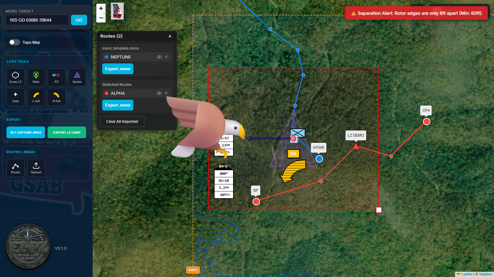

---

## Tips & troubleshooting

- **First action after idle is slow** — the backend spins down when unused; the first analysis/search after a while can take up to a minute while it wakes. Subsequent requests are fast.
- **Sign-in button does nothing / login popup blocked** — make sure your browser allows popups for the site, and give a slow backend a moment to respond after choosing an account.
- **Imported route looks like a straight line between two named points** — that's correct: the serpentine shaping points still exist (small dots). If a route is cluttering the view, hide it with the eye toggle instead of deleting.
- **On mobile**, the left panel is behind the ☰ button at the left of the top bar, quick-access tool buttons appear along the map edge, and the dock is a sheet along the bottom.
